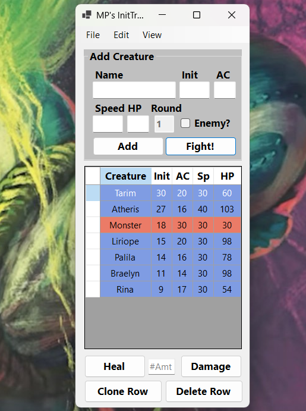

# MP's D&D Initiative Tracker

## Overview
MP's D&D Initiative Tracker is a lightweight GUI desktop application built in C#. It streamlines combat management for Dungeons & Dragons by providing an always-on-top window to display key combat data (such as initiative order and enemy HP) so you can focus on the game without filling your notes with unintelligible scribblings.

## Features
- **Manual Entry:** Add individual creatures by entering details like name, initiative, AC, speed, and HP.
- **Bulk Import:** Load an entire party or encounter from a comma-delimited text file.  
  **Expected format:**  
  `name, init, ac, speed, hp, (0 for ally, 1 for enemy)`
- **Save & Reload Encounters:** Save your current encounter to a text file and reload it later.
- **User-Friendly Interface:** Designed for quick access and ease of use during sessions.
- **Always on Top Window:** Keeps vital combat information visible at all times.

## Getting Started

### Prerequisites
- **Operating System:** Windows (the application is a standalone executable).

### Installation
1. **Download:** Get the ZIP file from the repository.
2. **Extract:** Unzip the file to your desired location.
3. **Run:** Open the folder and double-click `InitTracker.exe` to launch the application.

## Usage
- **Adding Creatures:** Use the interface to manually input creature details.
- **Saving Encounters:** Save your current session to a txt file to easily reload it in the future.
- **Import:** Use the import option to load a txt saved encounter to save yourself some time!

## Screenshot
  

## Contact
For questions or feedback, please contact Ben Cobb at [moltenpanther@gmail.com] or open an issue in this repository.
